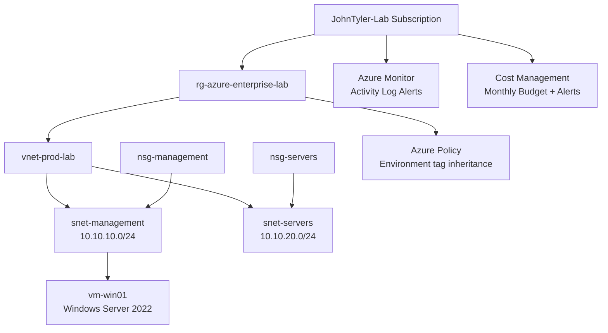
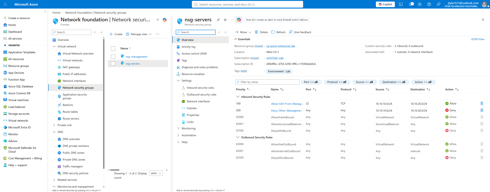
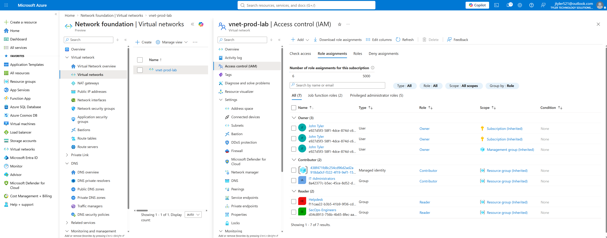
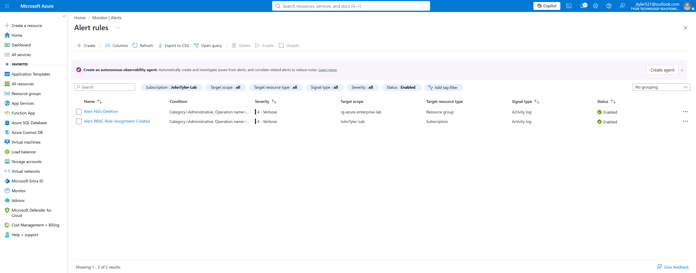
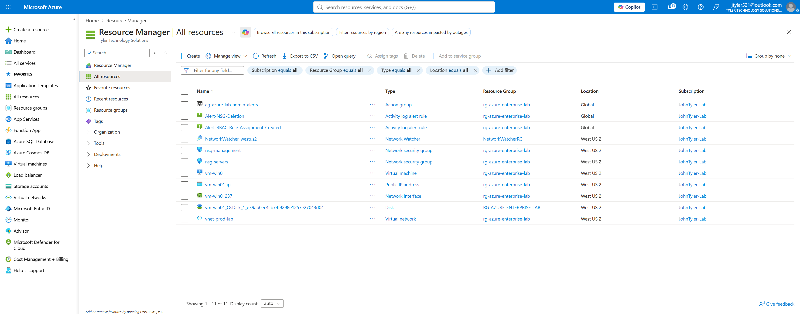

# Azure Enterprise Administration Lab

An enterprise-style Microsoft Azure administration lab focused on **network segmentation, RBAC, governance, policy remediation, monitoring, cost controls, and Windows Server administration**.

[](https://azure.microsoft.com/)
[](https://www.microsoft.com/windows-server)
[](https://www.youtube.com/watch?v=ETXv-iHt-tE)

## Video Walkthrough

**Full lab walkthrough:** https://www.youtube.com/watch?v=ETXv-iHt-tE

The video demonstrates the deployed Azure resources, network security controls, RBAC assignments, governance controls, monitoring rules, and Windows Server validation.

## Project Summary

This lab was built to go beyond a basic "deploy a VM" exercise. The environment models practical Azure administration tasks that would be expected in junior cloud, systems administration, IAM, and infrastructure-support roles.

### Core objectives

- Build a segmented Azure virtual network.
- Apply subnet-level Network Security Groups (NSGs).
- Restrict remote administration to approved traffic paths.
- Implement Azure RBAC with group-based permissions.
- Enforce governance through Azure Policy and remediation.
- Protect critical infrastructure with a resource lock.
- Configure cost governance with a subscription budget and alerts.
- Monitor sensitive control-plane activity with Azure Monitor Activity Log alerts.
- Deploy and remotely administer a Windows Server 2022 VM.
- Validate DNS, outbound HTTPS connectivity, and guest OS configuration with PowerShell.

## Architecture



## Azure Resources

| Resource | Purpose |
|---|---|
| `rg-azure-enterprise-lab` | Central resource group for the lab |
| `vnet-prod-lab` | Virtual network for segmented lab workloads |
| `snet-management` | Management subnet (`10.10.10.0/24`) |
| `snet-servers` | Server subnet (`10.10.20.0/24`) |
| `nsg-management` | Protects management subnet and controls RDP/segmentation traffic |
| `nsg-servers` | Protects server subnet and permits approved management traffic |
| `vm-win01` | Windows Server 2022 administration VM |
| `ag-azure-lab-admin-alerts` | Reusable Azure Monitor notification action group |
| `Alert-NSG-Deletion` | Activity Log alert for successful NSG deletion |
| `Alert-RBAC-Role-Assignment-Created` | Activity Log alert for successful RBAC role assignment creation |

## Network Security

### Management subnet

`nsg-management` is associated with `snet-management` at the subnet level. The design restricts RDP to an approved administrator source instead of exposing TCP/3389 to the entire internet.

Additional segmentation prevents the server subnet from freely initiating traffic into the management subnet.

### Server subnet

`nsg-servers` applies separate controls to `snet-servers`.

The rules shown in the lab include:

- Allow SSH from the management subnet to the server subnet on TCP/22.
- Deny other management-to-server traffic that is not explicitly approved.
- Retain Azure's default inbound/outbound NSG rules below the custom rules.



## Identity and Access Management

Azure RBAC is used to model least-privilege access through groups rather than relying exclusively on direct user assignments.

Examples shown in the lab include:

- `IT-Administrators` — Contributor access.
- `Helpdesk` — Reader access.
- `SecOps-Engineers` — Reader access.
- A policy-managed identity with Contributor permissions required for remediation.



## Azure Policy and Governance

A built-in Azure Policy assignment was configured:

**`Inherit a tag from the resource group if missing`**

Parameter:

```text
Environment
```

The parent resource group uses:

```text
Environment = Lab
```

### Remediation result

The initial evaluation found three resources missing the tag:

- `vnet-prod-lab`
- `nsg-management`
- `nsg-servers`

A remediation task was executed through a system-assigned managed identity. The result was:

```text
3 of 3 resources remediated
100% policy compliance
```

This demonstrates policy assignment, compliance evaluation, managed identity permissions, remediation, and automated resource governance.

## Resource Protection

A `CanNotDelete` resource lock was applied to `vnet-prod-lab`:

```text
Protect-VNet-From-Deletion
```

The lock reduces the chance of accidental removal of critical networking infrastructure while still allowing authorized configuration changes.

## Cost Governance

The `JohnTyler-Lab` subscription includes a dedicated monthly lab budget:

```text
Azure-Lab-Monthly-Budget
Budget: $25/month
```

Budget notifications provide early visibility into unexpected cloud spend. VM auto-shutdown is also configured as a direct operational cost-control measure.

## Monitoring and Alerting

Azure Monitor Activity Log alerts were configured for security-relevant control-plane events.

### Alert rules

- `Alert-NSG-Deletion`
  - Monitors successful Network Security Group deletion.
- `Alert-RBAC-Role-Assignment-Created`
  - Monitors successful Azure RBAC role assignment creation.

Both alerts use the reusable action group:

```text
ag-azure-lab-admin-alerts
```

The action group sends notifications to a verified email receiver.



## Windows Server VM

### VM configuration

| Setting | Value |
|---|---|
| VM | `vm-win01` |
| OS | Windows Server 2022 Datacenter: Azure Edition |
| Region | West US 2 |
| Size | Standard B2als_v2 |
| VNet | `vnet-prod-lab` |
| Subnet | `snet-management` |
| Private IP observed during validation | `10.10.10.4` |
| Security | Trusted Launch + Secure Boot |
| Boot diagnostics | Enabled |
| Auto-shutdown | 20:00 Pacific |

RDP access was successfully validated through the subnet-level management NSG.

## Guest OS Validation

The following PowerShell commands were used inside `vm-win01`:

```powershell
hostname
whoami
Get-NetIPConfiguration
Resolve-DnsName microsoft.com
Test-NetConnection microsoft.com -Port 443
systeminfo
```

Validation confirmed:

- Correct `vm-win01` hostname.
- Private addressing from `snet-management`.
- Working DNS resolution.
- Successful outbound HTTPS connectivity (`TcpTestSucceeded : True`).
- Windows Server 2022 Datacenter: Azure Edition guest OS.

## Resource Inventory

The deployed environment includes the Windows VM and its supporting network, monitoring, public IP, NIC, disk, NSGs, and Activity Log alert resources.



## Skills Demonstrated

- Microsoft Azure administration
- Azure Virtual Network design
- Subnet segmentation
- Network Security Groups
- Windows Server 2022 administration
- RDP troubleshooting
- Azure RBAC
- Group-based authorization
- Azure Policy
- Policy remediation
- Managed identities
- Resource tagging and governance
- Azure resource locks
- Azure Cost Management
- Budget alerts
- Azure Monitor
- Activity Log alert rules
- Action groups
- PowerShell validation and troubleshooting
- DNS and TCP connectivity testing

## Key Takeaways

This project demonstrates the operational relationship between **identity, networking, governance, monitoring, cost management, and Windows administration** in Azure. Rather than treating each feature as an isolated exercise, the lab integrates them into one managed environment and validates the result from both the Azure control plane and the Windows guest OS.

## Screenshots

| Screenshot | Description |
|---|---|
| [`azure-all-resources.png`](screenshots/azure-all-resources.png) | Azure resource inventory for the lab |
| [`azure-nsg.png`](screenshots/azure-nsg.png) | Server subnet NSG rules and association |
| [`azure-vnet-iam.png`](screenshots/azure-vnet-iam.png) | Azure RBAC role assignments |
| [`azure-alert-rules.png`](screenshots/azure-alert-rules.png) | Azure Monitor Activity Log alert rules |

## Repository Structure

```text
azure-enterprise-administration-lab/
├── README.md
├── docs/
│   ├── architecture.md
│   ├── build-notes.md
│   └── validation.md
├── scripts/
│   └── validate-vm.ps1
└── screenshots/
    ├── azure-alert-rules.png
    ├── azure-all-resources.png
    ├── azure-nsg.png
    └── azure-vnet-iam.png
```

---

**Video:** https://www.youtube.com/watch?v=ETXv-iHt-tE
